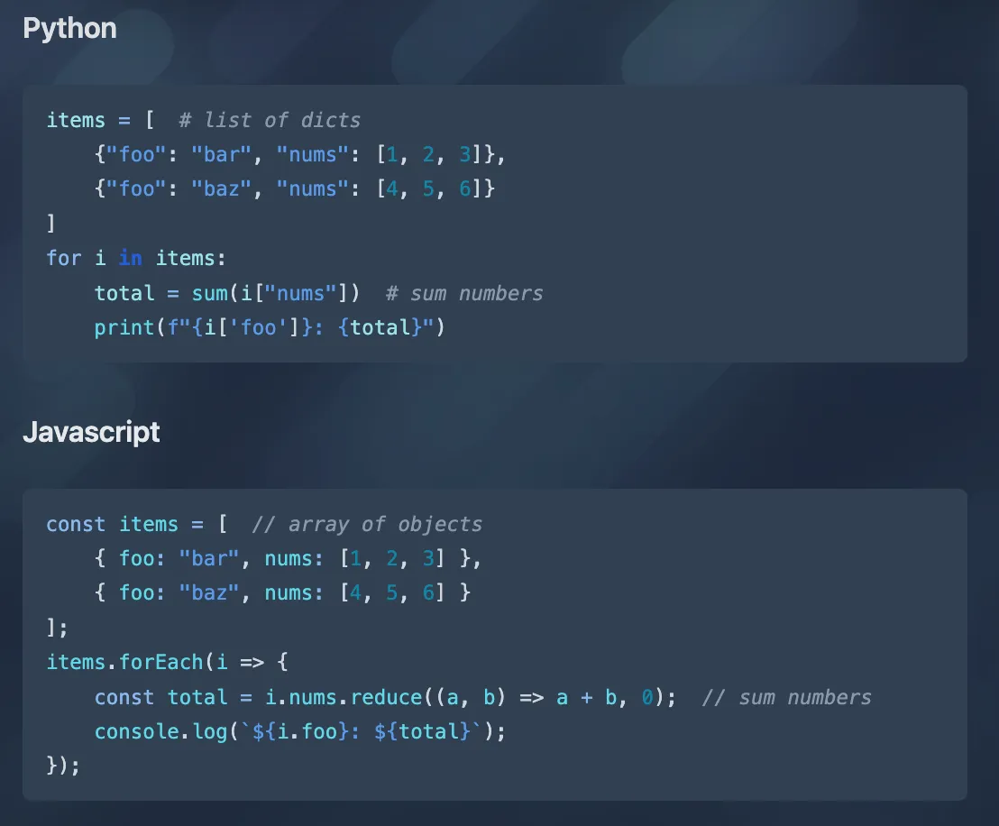
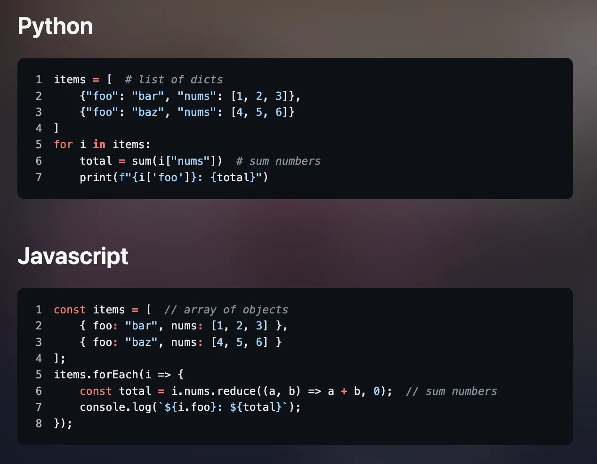

# Blowfish-Refined ([DEMO](https://ZhenShuo2021.github.io/blowfish-refined))

This project is a major improvement of the popular [Blowfish](https://github.com/nunocoracao/blowfish) Hugo theme. While based on Blowfish's solid foundation, working with it showed some architectural issues that inspired me to try different solutions.

As I explored the modifications further, I discovered that Hugo themes using Tailwind CSS face inherent architectural limitations—structural issues that remain unsolvable as long as Tailwind is used within the Hugo framework. I've outlined the details in [this article](https://dev.to/zhenshuo2021/tailwind-css-in-hugo-is-a-scam-2b5e). To preserve my work, I've published my modifications as a public template.

This refined version builds upon Blowfish v2.86.0 (2025/06).

To see the demo site, please visit the [DEMO](https://ZhenShuo2021.github.io/blowfish-refined).

To try the refined version locally:

```sh
git clone https://github.com/ZhenShuo2021/blowfish-refined
pnpm install
pnpm run dev
```

Or install the theme:

```sh
git submodule add https://github.com/ZhenShuo2021/blowfish-refined.git themes/blowfish-refined
```

## Sections

- [Addressing Tailwind CSS Limitations](#addressing-tailwind-css-limitations)
- [Resolving Configuration Problems](#resolving-configuration-problems)
  - [Addressing Naming Ambiguities](#addressing-naming-ambiguities)
  - [Implementing Explicit Error Handling](#addressing-naming-ambiguities)
  - [Simplifying Image Configuration](#simplifying-image-configuration)
- [Focusing on Core Features](#focusing-on-core-features)
- [Reducing Repository Size](#reducing-repository-size)
- [Removing jQuery Dependency](#removing-jquery-dependency)
- [Adopting CDN-First Architecture](#adopting-cdn-first-architecture)
- [Fixing Show More Section Coverage](#fixing-show-more-section-coverage)
- [Improving Syntax Highlighting](#improving-syntax-highlighting)
- [Enhancing Markdown Portability](#enhancing-markdown-portability)
- [Better HTML Structure](#better-html-structure)
  - [Improving Semantic Markup](#improving-semantic-markup)
  - [Adding External Link Indicators](#adding-external-link-indicators)
- [Improving Shortcode Implementation](#improving-shortcode-implementation)
  - [Slide Shortcode Enhancement](#slide-shortcode-enhancement)
  - [Hint Shortcode](#hint-shortcode)
- [Addressing Documentation Problems (mostly not done)](#addressing-documentation-problems-mostly-not-done)
  - [Performance Considerations](#performance-considerations)
  - [Installation Process](#installation-process)
  - [Configuration Setup](#configuration-setup)
  - [Content Organization Observations](#content-organization-observations)
  - [Technical Section Clarity](#technical-section-clarity)
  - [Structural Flow](#structural-flow)
  - [Design System Considerations](#design-system-considerations)
- [Implementing Complete Architectural Refactor](#implementing-complete-architectural-refactor)
  - [Establishing Clear Code Organization](#establishing-clear-code-organization)
  - [Migrating to New Hugo Architecture](#migrating-to-new-hugo-architecture)
  - [Zero-Coupling Architecture](#zero-coupling-architecture)
  - [Addressing Code Quality Issues](#addressing-code-quality-issues)
  - [Optimizing CSS Implementation](#optimizing-css-implementation)
  - [Separating Core Styles from Enhancements](#separating-core-styles-from-enhancements)

## Addressing Tailwind CSS Limitations

The refined version implements true Tailwind CSS integration using Hugo's `css.TailwindCSS` processor, moving away from the pre-compiled CSS approach used in the original.

Pre-compiled Tailwind CSS creates significant limitations that fundamentally undermine the framework's core value proposition. When Tailwind utilities are flattened into pure CSS after the build, users lose access to dynamic class composition within templates and content files. Responsive variants become non-functional, state-based modifiers like `hover` and `focus` stop working, and conditional class generation becomes impossible.

This essentially reduces Tailwind to a static CSS library—defeating its primary purpose as a utility-first framework. My [article](https://dev.to/zhenshuo2021/tailwind-css-in-hugo-is-a-scam-2b5e) explains why this architectural choice creates these limitations.

## Resolving Configuration Problems

### Addressing Naming Ambiguities

The original theme includes several configuration parameters that share names across different contexts, which can create confusion during setup. A notable example: `hero` functions as both a homepage background layout identifier and an article layout configuration parameter. This pattern appears in multiple places throughout the configuration system, requiring users to carefully distinguish between identically-named but functionally different options.

I've renamed configuration parameters where ambiguity exists to establish clearer, more descriptive naming conventions.

### Implementing Explicit Error Handling

The original theme employs extensive fallback logic that, while user-friendly in intention, can mask configuration errors. This approach sometimes prevents users from identifying misconfigurations, potentially leading to unexpected behavior that can be challenging to debug.

The refined version removes silent fallback mechanisms in favor of explicit error messages. Invalid configurations now generate clear feedback, enabling users to quickly identify and resolve issues rather than troubleshooting unexpected behavior.

### Simplifying Image Configuration

The original theme accepts multiple keywords (`*feature*`, `*background*`, `*cover*`, `*thumbnail*`) for what is essentially a single feature image concept. While this provides flexibility, it can create unnecessary complexity during configuration without offering meaningful functional differentiation.

The refined version standardizes on `*feature*` exclusively, simplifying the decision-making process while maintaining full functionality.

## Focusing on Core Features

Through observation of community usage patterns, I identified numerous features and shortcodes that see limited adoption. Features like the `thumbAndBackground` layout show minimal usage, while specialized shortcodes such as `gitea` and `forgejo` serve very specific use cases that can increase cognitive load for new users.

I've removed these low-adoption features to reduce cognitive overhead and maintain focus on core functionality. Hugo's architecture makes custom extensions **extreme simple** for users requiring specialized features—there's no need to bloat the base theme with rarely-used functionality.

As an upstream repository, we should focus on the core use case, not trying to cover all cases.

## Reducing Repository Size

The original repository is approximately 500MB—significantly larger than typical Hugo themes which average 10-50MB. This size stems primarily from the `users` demo directory, which stores binary screenshot files that accumulate with each update cycle, adding roughly 10MB per update.

The refined version eliminates this historical baggage, reducing the total size to under 10MB while including a complete example site.

## Removing jQuery Dependency

All JavaScript has been rewritten using native browser APIs, eliminating the jQuery dependency. This results in improved performance, smaller bundle size, and zero third-party runtime dependencies.

## Adopting CDN-First Architecture

Rather than bundling external libraries, all dependencies load via CDN. This eliminates the maintenance overhead of tracking dependency updates through automated pull requests while giving users control over library versions.

Using CDN delivery provides better performance, automatic geographic distribution, and simplified dependency management compared to self-hosting JavaScript libraries.

## Fixing Show More Section Coverage

Blowfish supports `mainSections` to display posts from multiple sections. However, the `Show More` button only loads posts from one section, ignoring others. For example, if `mainSections` includes `A`, `B`, and `C`, the button may only show additional posts from `A`.

A `more-articles.html` partial has been introduced to address this. It ensures `Show More` aggregates posts from all defined sections, matching the expected behavior.

## Improving Syntax Highlighting

Visual comparison shows the difference clearly:

Original highlighting: 
Refined highlighting: 

The original theme applies a single blue tone to all code elements, with highlighting styles hardcoded directly into `main.css`. This setup makes customization restrictive and difficult to extend.

The refined version follows Hugo's official syntax highlighting standards, using pure Chroma CSS for fully modular and themeable styling. Users can switch highlighting themes instantly with a simple command:

```sh
hugo gen chromastyles --style=github > assets/css/components/chroma-light.css
hugo gen chromastyles --style=github-dark > assets/css/components/chroma-dark.css
```

This approach offers complete flexibility and clean separation of styles, making customization straightforward.

## Enhancing Markdown Portability

The original theme requires Hugo-specific shortcodes for mathematical expressions (``) and diagrams (``). This creates two challenges:

1. Hugo shortcode syntax is verbose and disrupt writing flow
2. Content becomes tied to Hugo, limiting portability to other static site generators

Markdown's strength lies in its cross-platform compatibility, but theme-specific shortcodes break this portability.

The refined version enables mathematical typesetting through simple frontmatter configuration:

```yaml
useKatex: true
```

Diagram support uses standard GitHub-compatible syntax:

````markdown

````

This maintains full functionality while preserving markdown portability across platforms.

## Better HTML Structure

### Improving Semantic Markup

The original theme implements some HTML structures that can create accessibility challenges, particularly making entire article cards clickable links while embedding additional clickable elements within them. This can create confusing user interactions and accessibility issues.

The refined version implements proper semantic markup where only appropriate elements (cover images, titles) function as navigation links, while other content remains non-interactive.

### Adding External Link Indicators

Similar to VitePress, external link indicators are now available as an optional feature to help users recognize when they're navigating away from the site.

## Improving Shortcode Implementation

While removing rarely-used shortcodes, I've enhanced those that provide genuine value:

### Slide Shortcode Enhancement

The original carousel shortcode has several functional limitations: the `interval` parameter doesn't work as expected, and the `aspectRatio` setting crops images that don't match exact dimensions, which can affect visual composition. Additionally, when URLs become long, the shortcode becomes difficult to read or modify, since all values are embedded as plain strings without clear structure.

The refined version replaces this with a more flexible slide shortcode. Compare the syntax:

Original carousel approach:

```html-go-template
{{< carousel images="{https://cdn.pixabay.com/photo/2016/12/11/12/02/mountains-1899264_960_720.jpg, https://cdn.pixabay.com/photo/foo.jpg, https://cdn.pixabay.com/photo/bar.jpg, gallery/02.jpg, gallery/04.jpg}" >}}
```

Refined slide approach:

```html-go-template

src=https://cdn.pixabay.com/photo/2016/12/11/12/02/mountains-1899264_960_720.jpg
src=https://cdn.pixabay.com/photo/foo.jpg
src=https://cdn.pixabay.com/photo/bar.jpg
src=gallery/02.jpg
src=gallery/04.jpg

```

Or for directory-based galleries:

```html-go-template

dir=gallery

```

The new implementation also supports captions and handles varying image dimensions more gracefully.

### Hint Shortcode

[Docusaurus' admonition](https://docusaurus.io/docs/markdown-features/admonitions) has proven successful in the documentation community. My idea is simple: if this is better, we use the better one.

## Addressing Documentation Problems (mostly not done)

The original documentation has several organizational aspects that could be improved for better user experience:

### Performance Considerations

The documentation site uses SVG backgrounds that can cause frequent browser repainting, resulting in elevated CPU usage even on modern hardware. This performance characteristic has been noted in [community discussions](https://github.com/nunocoracao/blowfish/discussions/2145).

### Installation Process

The currently recommended installation method uses an additional `npx`-based CLI tool. While this aims to simplify the process, it introduces an extra dependency that not always provide the most streamlined experience.

A more direct approach would be:

1. Create an empty Git project
2. Add `blowfish-refined` as a Git submodule
3. Copy all contents from `themes/blowfish-refined/exampleSite` to the project root

This provides a complete, working setup without additional tooling dependencies.

For users migrating from other themes or static site generators with existing Markdown content:

1. Add `blowfish-refined` as a Git submodule
2. Replace the config directory with `themes/blowfish-refined/exampleSite/config/_default`

This minimizes setup complexity. Users only need to clean up unused language options and perform minimal configuration adjustments to match their content structure.

### Configuration Setup

Rather than presenting isolated configuration tables, documentation could benefit from recommending the example site's configuration as a starting point. This ensures all necessary settings are included and aligned with the theme's expected structure.

Using the example configuration directly offers a reliable baseline, making the setup process more predictable.

### Content Organization Observations

Information appears in multiple sections (getting-started, content-examples, thumbnail_sample) without clear boundaries or logical progression. This can require users to review the same information multiple times in different contexts.

Similar patterns appear in math, mermaid and multiple-authors sections.

### Technical Section Clarity

The "Partials" section title may not immediately convey its content to all users. The actual content covers extending core functions: adding comment systems, favicons, icons, and integrating analytics.

Having personally overridden more than 10 partials as an end user and contributed over 30 pull requests, I still didn't understand why this section was titled "Partials" until I updated the documentation myself. Only then did I systematically think: why is it called "Partials"? Eventually, I realized the only connection is that these features are implemented using Hugo's partial function. This requires knowledge of Hugo's internal partial system, yet it is presented as a user-level feature.

End users typically need extension points rather than internal implementation details. My attempts to improve this clarity were [not accepted](https://github.com/nunocoracao/blowfish/pull/2174).

### Structural Flow

The documentation structure could benefit from more logical progression, as it currently moves between topics:

1. **Configuration** - presents a massive configuration table
2. **Homepage Layout** - showcase but already configured in the previous section
3. **Shortcodes** - abruptly shifts to content creation
4. **Frontmatter Configuration** - go back to configuration part
5. **Partials** - jumps to advanced internal topics
6. **Thumbnails** - returns to basic image usage
7. **Content Examples** - places beginner information later in the structure
8. **Series** - it was configured in the frontmatter part
9. **Advanced Customisation** - revisits partials override already mentioned earlier

This organization can require users to navigate back and forth repeatedly.

### Design System Considerations

The documentation could benefit from a proper introduction to the color system, potentially following established design principles like [Material Design](https://m2.material.io/design/color/the-color-system.html). The color-secondary system also receives limited utilization currently.

## Implementing Complete Architectural Refactor

### Establishing Clear Code Organization

The refined version reorganizes the entire codebase structure. Finding specific override targets in the original layout directory requires extensive searching, with major elements (`footer`, `header`) mixed among smaller UI components (`badge`, `author`).

The original structure shows this organization:

```text
layouts/partials
├── article-pagination.html
├── author-extra.html
├── author-links.html
├── author.html
├── badge.html
├── breadcrumbs.html
├── css.html
├── footer.html
├── head.html
├── icon.html
├── pagination.html
├── related.html  
├── schema.html
├── scroll-to-top.html
├── search.html
├── sharing-links.html
├── toc.html
├── translations.html
├── vendor.html
├── analytics/
├── article-link/
├── article-meta/
├── functions/
├── header/
├── hero/
├── home/
├── meta/
├── recent-articles/
├── series/
└── term-link/
```

The refined structure provides logical organization with common elements properly separated, using clearer names:

```text
layouts/_partials
├── article-pagination.html
├── footer.html
├── list-pagination.html  
├── related.html
├── toc.html
├── functions/
├── head/
├── header/
├── home-templates/
├── metadata/
├── page-templates/
└── ui/
```

In addition, various issues were also addressed during restructuring.

### Migrating to New Hugo Architecture

The refined version adopts Hugo's [new template system](https://gohugo.io/templates/new-templatesystem-overview/) introduced in v0.146.0, providing future compatibility.

### Zero-Coupling Architecture

Following the principle that [everything should be repeated](https://programmingisterrible.com/post/176657481103/repeat-yourself-do-more-than-one-thing-and), the refined version eliminates code coupling. Each file contains everything needed for understanding its functionality without requiring knowledge of other parts of the codebase.

### Addressing Code Quality Issues

The original codebase uses inconsistent formatting that can make maintenance challenging. My [PR](https://github.com/nunocoracao/blowfish/pull/2176) identified multiple indentation styles used throughout:

1. [1-space indentation](https://github.com/nunocoracao/blowfish/blob/0b06a64139beba6287e7685f4c810ad4ff772fde/layouts/partials/hero/background.html)
2. 2-space indentation (most common)
3. [4-space indentation](https://github.com/nunocoracao/blowfish/blob/0b06a64139beba6287e7685f4c810ad4ff772fde/layouts/partials/home/background.html)
4. [No indentation](https://github.com/nunocoracao/blowfish/blob/0b06a64139beba6287e7685f4c810ad4ff772fde/layouts/partials/head.html) making closing statements difficult to identify
5. [Mixed indentation within files](https://github.com/nunocoracao/blowfish/blob/0b06a64139beba6287e7685f4c810ad4ff772fde/layouts/partials/article-link/simple.html)
6. [Misleading indentation from typos](https://github.com/nunocoracao/blowfish/blob/0b06a64139beba6287e7685f4c810ad4ff772fde/layouts/partials/header/basic.html#L144-L145)

The refined version standardizes all formatting and implements pre-commit hooks to prevent future formatting inconsistencies.

### Optimizing CSS Implementation

Code optimization results in significant size reduction:

- Original CSS: ~700 lines → Refined: ~300 lines  
- Compiled CSS: ~4900 lines → Refined: ~3600 lines

This reduction comes from eliminating redundancy and focusing on essential styling without sacrificing functionality.

### Separating Core Styles from Enhancements

The refined version adopts a clear separation between core functionality and optional enhancements. The base theme provides essential styling only, while visual improvements and polished effects are implemented separately in `exampleSite/custom.css`.

This architectural approach offers users maximum flexibility:

Users seeking the enhanced appearance showcased in the demo site can retain the custom styles without any additional setup—achieving identical visual results immediately. Those preferring minimal styling can simply remove or ignore the custom CSS file, maintaining clean, lightweight styling.

## Attribution

This project is licensed under the MIT License. The copyright and permission notices must be included in all copies or substantial portions of the project. Additionally, any public use of this theme must provide clear attribution to the original project, including the theme name and author, for example in the website footer.

Original theme copyright Nuno Coração (https://nunocoracao.com).
