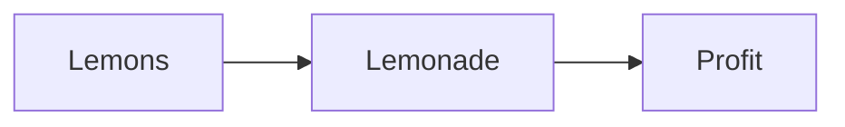

Beyond the [standard Hugo shortcodes](https://gohugo.io/content-management/shortcodes/), Blowfish provides additional features to enhance your content. Each section is ordered by usage frequency.



Since Markdown content is often intended for use **across platforms**, it is preferable to use standard HTML elements such as `<div>` instead of Hugo-specific shortcodes. This ensures better portability and compatibility, as shortcodes work only within Hugo.



## Visual Features

These shortcodes and HTML elements make your markdown content more engaging and interactive.

### Hint

The `hint` shortcode creates styled alert blocks similar to [Docusaurus admonitions](https://docusaurus.io/docs/markdown-features/admonitions). Each hint displays with a distinct color and icon based on its type.

| Parameter | Description                                                                                  |
| --------- | -------------------------------------------------------------------------------------------- |
| `type`    | Optional. Alert style: `note`, `tip`, `info`, `warning`, `danger`. Defaults to `tip`.       |
| `title`   | Optional. Custom heading text. Uses capitalized type if not specified.                      |

**Usage:**

```markdown

This is a note.



This is a info.



This is a helpful tip.



This is a warning message.



This is a danger alert.

```


This is a note.



This is a info.



This is a helpful tip.



This is a warning message.



This is a danger alert.


### Figure

The `figure` shortcode provides better image control than basic Markdown syntax—supporting captions, custom styling, width adjustment, and link wrapping.

Blowfish enhances Hugo's built-in `figure` shortcode with optimized performance while maintaining full compatibility. Unlike other themes that limit functionality for optimization, Blowfish preserves all native features seamlessly.

See the [Hugo documentation](https://gohugo.io/shortcodes/figure/) for complete parameters. Common options include:

| Parameter | Description                                                                                  |
| --------- | -------------------------------------------------------------------------------------------- |
| `src`     | **Required.** Image path or URL. Searches: page resources, `assets/`, then `static/`.       |
| `alt`     | Alt text for accessibility and SEO.                                                         |
| `href`    | Makes image clickable with this link.                                                       |
| `target`  | Link target (e.g., `_blank` for new tab).                                                   |
| `caption` | Text below image. Supports Markdown formatting.                                             |
| `class`   | Additional CSS classes.                                                                      |

**Example:**

```md


<!-- Standard Markdown (use when no extra features needed) -->
 on [Unsplash](https://unsplash.com/)")
```



### Slide

`slide` shortcode provides an image carousel component with left and right buttons and swipe functionality. You can define each image’s `src` and corresponding `caption` line by line, or import an entire directory at once using `dir=`.

**Example 1: Basic Carousel**

```md

width=90%



```


width=90%   


**Example 2: Auto-load From Directory**

```md

width=100%
dir=gallery
caption=First Image
caption=Second Image
caption=Third Image
caption=4th Image
caption=5th Image
caption=6th Image
caption=7th Image

```


width=100%
dir=gallery
caption=First Image
caption=Second Image
caption=Third Image
caption=4th Image
caption=5th Image
caption=6th Image
caption=7th Image


This will include all images from `assets/gallery/`, sorted alphabetically.

### Gallery

The `gallery` shortcode displays multiple images in responsive, flexible layouts.

Use `img` tags with `class="grid-wXX"` to control column widths. Available widths range from 10% to 100% in 5% steps (e.g., `grid-w65` for 65%). Special classes `grid-w30` and `grid-w66` support 3-column layouts. Combine with Tailwind responsive prefixes for adaptive grids.

**Example 1: Basic Gallery**

```md

  
  
  
  
  
  
  

```


  
  
  
  
  
  
  


**Example 2: Responsive Gallery**

```md

  
  
  
  
  
  
  

```


  
  
  
  
  
  
  


### KaTeX

Render mathematical expressions in your content.

Add `useKatex: true` to your page frontmatter to enable math support. Use `\(` and `\)` for inline expressions, or `$$` delimiters for block equations.

**Inline Math:**

```md
This is an inline equation \(f(a,b,c) = (a^2+b^2+c^2)^3\)
```

This is an inline equation \(f(a,b,c) = (a^2+b^2+c^2)^3\)

**Block Math:**

```latex
$$
\begin{align}
&h_{\text{LOS}} &&= e^{(j2\pi\mathcal{N}(1,1))} \newline
&h_{\text{NLOS}} &&= \mathcal{CN}(0, \sigma^2)
\end{align}
$$
```

$$
\begin{align}
&h_{\text{LOS}} &&= e^{(j2\pi\mathcal{N}(1,1))} \newline
&h_{\text{NLOS}} &&= \mathcal{CN}(0, \sigma^2)
\end{align}
$$

See the [mathematical notation samples]() page for more examples.

### Mermaid

Create diagrams using text-based syntax. Following Hugo's approach, no shortcode wrapper is needed—just use fenced code blocks.

**Example:**

`````txt

`````


Check the [official Mermaid documentation](https://mermaid-js.github.io/) for syntax details and diagram types. Additional examples are available on the [diagrams and flowcharts samples]() page.

### Chart

Embed interactive charts using Chart.js. Simply provide chart configuration between the shortcode tags—Chart.js handles the rendering.

Refer to the [Chart.js documentation](https://www.chartjs.org/docs/latest/general/) for configuration options and [chart types](https://www.chartjs.org/docs/latest/samples/).

**Example:**

```js

type: 'bar',
data: {
  labels: ['Tomato', 'Blueberry', 'Banana', 'Lime', 'Orange'],
  datasets: [{
    label: '# of votes',
    data: [12, 19, 3, 5, 3],
  }]
}

```


type: 'bar',
data: {
  labels: ['Tomato', 'Blueberry', 'Banana', 'Lime', 'Orange'],
  datasets: [{
    label: '# of votes',
    data: [12, 19, 3, 5, 3],
  }]
}


More Chart.js examples are available on the [charts samples]() page.

### Timeline

Create visual timelines for professional experience, project milestones, or any chronological content. Use `timelineItem` sub-shortcodes to define each entry.

| Parameter   | Description                    |
| ----------- | ------------------------------ |
| `icon`      | Icon for the timeline marker   |
| `header`    | Main heading for the entry     |
| `badge`     | Text for the top-right badge   |
| `subheader` | Secondary heading text         |

**Example:**

```md



Lorem ipsum dolor sit amet, consectetur adipiscing elit. Vivamus non magna ex. Donec sollicitudin ut lorem quis lobortis. Nam ac ipsum libero. Sed a ex eget ipsum tincidunt venenatis quis sed nisl. Pellentesque sed urna vel odio consequat tincidunt id ut purus. Nam sollicitudin est sed dui interdum rhoncus.



With html code
<ul>
  <li>Coffee</li>
  <li>Tea</li>
  <li>Milk</li>
</ul>



With other shortcodes

  
  
  
  
  
  
  








```




Lorem ipsum dolor sit amet, consectetur adipiscing elit. Vivamus non magna ex. Donec sollicitudin ut lorem quis lobortis. Nam ac ipsum libero. Sed a ex eget ipsum tincidunt venenatis quis sed nisl. Pellentesque sed urna vel odio consequat tincidunt id ut purus. Nam sollicitudin est sed dui interdum rhoncus.



With html code
<ul>
  <li>Coffee</li>
  <li>Tea</li>
  <li>Milk</li>
</ul>



With other shortcodes

  
  
  
  
  
  
  









### TypeIt

[TypeIt](https://www.typeitjs.com) is the most versatile JavaScript tool for creating typewriter effects on the planet. With a straightforward configuration, it allows you to type single or multiple strings that break lines, delete & replace each other, and it even handles strings that contain complex HTML.

Blowfish implements a sub-set of TypeIt features using a `shortcode`. Write your text within the `typeit` shortcode and use the following parameters to configure the behavior you want.

| Parameter          | Description                                                                                                                                        |
| ------------------ | -------------------------------------------------------------------------------------------------------------------------------------------------- |
| `tag`              | [String] `html` tag that will be used to render the strings.                                                                                       |
| `classList`        | [String] List of `css` classes to apply to the `html` element.                                                                                     |
| `initialString`    | [String] Initial string that will appear written and will be replaced.                                                                             |
| `speed`            | [number] Typing speed, measured in milliseconds between each step.                                                                                 |
| `lifeLike`         | [boolean] Makes the typing pace irregular, as if a real person is doing it.                                                                        |
| `startDelay`       | [number] The amount of time before the plugin begins typing after being initialized.                                                               |
| `breakLines`       | [boolean] Whether multiple strings are printed on top of each other (true), or if they're deleted and replaced by each other (false).              |
| `waitUntilVisible` | [boolean] Determines if the instance will begin when loaded or only when the target element becomes visible in the viewport. The default is `true` |
| `loop`             | [boolean] Whether your strings will continuously loop after completing                                                                             |

**Example:**

```md

散れば咲き 散れば咲きして 百日紅  

```


散れば咲き 散れば咲きして 百日紅  


### Icon

`icon` outputs an SVG icon and takes the icon name as its only parameter. The icon is scaled to match the current text size.

**Example:**

```md

```

**Output:** 

Icons are populated using Hugo pipelines which makes them very flexible. Blowfish includes a number of built-in icons for social, links and other purposes. Check the [icon samples]() page for a full list of supported icons.

Custom icons can be added by providing your own icon assets in the `assets/icons/` directory of your project. The icon can then be referenced in the shortcode by using the SVG filename without the `.svg` extension.

Icons can also be used in partials by calling the [icon partial]().

### Badge

`badge` outputs a styled badge component which is useful for displaying metadata.

**Example:**

```md

New article!

```


New article!


### LTR/RTL

`ltr` and `rtl` allows you to mix your contents. Many RTL language users want to include parts of the content in LTR. Using this shortcode will let you do so, and by leveraging `%` as the outer-most dilemeter in the shortcode [Hugo shortcodes](https://gohugo.io/content-management/shortcodes/#shortcodes-with-markdown), any markdown inside will be rendered normally.

**Example:**

```md
- This is an markdown list.
- Its per default a LTR direction
{}
- هذه القائمة باللغة العربية
- من اليمين الى اليسار
{}
```

- This is an markdown list.
- Its per default a LTR direction
{}
- هذه القائمة باللغة العربية
- من اليمين الى اليسار
{}

## Content Embedding

These shortcodes let you import and display content from external sources.

### Gist

Embed GitHub Gists directly into your content. Specify the user, Gist ID, and optionally a specific file.

| Parameter      | Description                                                        |
| -------------- | ------------------------------------------------------------------ |
| `[0]`          | GitHub username (string)                                           |
| `[1]`          | Gist ID (string)                                                   |
| `[2]` (optional)| Specific filename to embed (string)                               |

**Example 1: Entire Gist**

```md

```



**Example 2: Specific File**

```md

```



### GitHub Card

Display GitHub repository information with live stats like stars and forks.

| Parameter       | Description                                                   |
|-----------------|---------------------------------------------------------------|
| `repo`          | Repository in `username/repo` format (string)                |
| `showThumbnail` | Optional. Show repository thumbnail (boolean)                 |

**Example:**

```md

```



### Code Importer

Import code files from external sources without copy-pasting. Note this uses different parameter to Blowfish's version.

| Parameter | Description                                                                          |
| --------- | ------------------------------------------------------------------------------------ |
| `url`     | **Required.** URL to the external code file                                         |
| `lang`    | Optional. Language for syntax highlighting. Auto-detects from file extension        |
| `line`    | Optional. Line range as `start-end`. Omit start or end for open ranges             |

**Example 1: Complete File**

```md

```



**Example 2: First 2 Lines**

```md

```



### Markdown Importer

Import markdown content from external sources like other repositories or websites.

| Parameter | Description                                             |
| --------- | ------------------------------------------------------- |
| `url`     | **Required.** URL to the external markdown file        |

**Example:**

```md

```



### YouTube Lite

Embed YouTube videos using the lightweight [lite-youtube-embed](https://github.com/paulirish/lite-youtube-embed) library for faster loading.

| Parameter | Description                                  |
| --------- | -------------------------------------------- |
| `id`      | YouTube video ID (string)                    |
| `label`   | Video description label (string)             |
| `params`  | Additional playback parameters (string)      |

**Example 1: Basic Video**

```md

```



**Example 2: Custom Parameters**

Use YouTube's [player parameters](https://developers.google.com/youtube/player_parameters#Parameters) to customize playback:

> Video starts at 2 minutes 10 seconds:

```md

```

> Video with no controls, starts at 130 seconds, ends 10 seconds later:

Combine parameters with `&`:

```md

```



See the [lite-youtube-embed documentation](https://github.com/paulirish/lite-youtube-embed/blob/master/readme.md#custom-player-parameters) and YouTube's [parameter reference](https://developers.google.com/youtube/player_parameters#Parameters) for more options.

### Article

Embed a single article into your markdown content. Use the article's `.RelPermalink` as the link value. The shortcode won't display anything when referencing its parent page.

*Note: If your site runs in a subfolder (e.g., `/blowfish/`), include that path in the link.*

| Parameter | Description                                              |
| --------- | -------------------------------------------------------- |
| `link`    | **Required.** The `.RelPermalink` to the target article |

**Example:**

```md

```



### List

Display a list of recent articles with optional filtering. The shortcode excludes its parent page but counts it toward the limit.

| Parameter  | Description                                                                                                                                             |
| ---------- | ------------------------------------------------------------------------------------------------------------------------------------------------------- |
| `limit`    | **Required.** Number of articles to display                                                                                                            |
| `title`    | Optional. List heading. Defaults to "Recent"                                                                                                           |
| `cardView` | Optional. Enable card layout. Defaults to `false`                                                                                                      |
| `where`    | Optional. Page parameter for filtering (e.g., `Type`)                                                                                                  |
| `value`    | Optional. Value to match with `where` parameter (e.g., `sample`)                                                                                       |


The `where` and `value` parameters use Hugo's query format: `where .Site.RegularPages $where $value`. Check the [Hugo documentation](https://gohugo.io/methods/page/) for available page parameters.


**Example 1: Basic List**

```md

```



**Example 2: Filtered Card View**

```md

```


